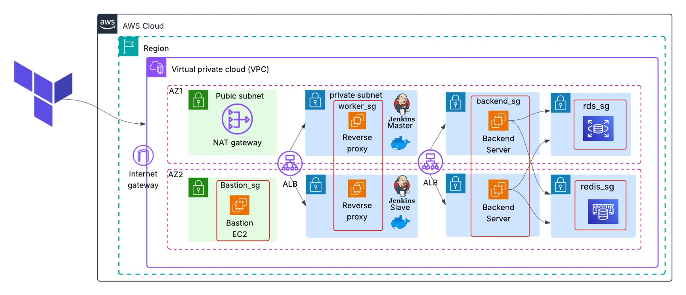

# AWS Multi-Tier Infrastructure Automation with Terraform


This Terraform project automates the provisioning of AWS infrastructure components, including networking, compute, databases, caching, and load balancing.

## Project Structure

- `network/`  
  Contains Terraform configurations for the AWS networking layer:
  - `vpc.tf` — VPC definition  
  - `subnets.tf` — Public and private subnets  
  - `internet-gateway.tf` — Internet Gateway resource  
  - `nat.tf` — NAT Gateway for private subnet outbound access  
  - `pub-route-table.tf` — Route table for public subnets  
  - `priv-route-table.tf` — Route table for private subnets  
  - `SGs.tf` — Security Groups definitions  
  - `variables.tf` — Variables used in the network configs  
  - `outputs.tf` — Network outputs like VPC ID, subnet IDs, etc.

- Root directory  
  Contains Terraform configurations for core services and resources:
  - `ami.tf` — AMI data source definitions  
  - `backend.tf` — Remote backend configuration for Terraform state  
  - `EC2s.tf` — EC2 instances definitions (application servers, bastion, etc.)  
  - `elasticache.tf` — AWS ElastiCache Redis cluster configuration  
  - `key.tf` — SSH key pair resource for EC2 access  
  - `main.tf` — Main Terraform file (calls modules or main resources)  
  - `outputs.tf` — Outputs for root-level resources  
  - `provider.tf` — AWS provider and version config  
  - `private_alb.tf` — Private Application Load Balancer setup  
  - `public_alb.tf` — Public Application Load Balancer setup  
  - `RDS.tf` — AWS RDS (MySQL/PostgreSQL) instance configuration  
  - `terraform.tfvars` — Terraform variable values file  
  - `variables.tf` — Root variables definition  
  - `README.md` — This documentation file  
  - `Notes.md` — Additional notes and explanations  

## Prerequisites

- Terraform installed (version compatible with your AWS provider)  
- AWS CLI configured with appropriate credentials and permissions  
- SSH key pair for EC2 instance access

## Usage

1. Initialize Terraform working directory:
   ```bash
   terraform init
   ```
2. Review planned infrastructure changes:
   ```bash
   terraform plan -var-file="terraform.tfvars"
   ```
3. Apply changes to provision infrastructure:
   ```bash
   terraform apply -var-file="terraform.tfvars"
   ```

4. Destroy infrastructure when no longer needed:
   ```bash
   terraform destroy -var-file="terraform.tfvars"
   ```

## Notes

- The infrastructure is designed with a multi-tier architecture, separating public and private subnets for security and scalability.

- Load balancers are deployed both publicly (for frontend access) and privately (for backend services).

- ElastiCache and RDS are provisioned for caching and relational database services, respectively.

- Security groups control access between layers.

- Variables and sensitive information should be managed carefully (use of .tfvars and optionally secrets management).