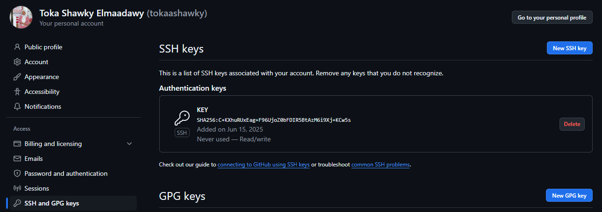

# Kubernetes CICD Project Using Github Actions and ArgoCD

For a comprehensive guide on deploying and managing cloud-native applications using AWS, Kubernetes, and DevOps tools, watch the detailed tutorial:

- [Step 1: SSH Exchange between local computer and Github account.](#step-1-ssh-exchange-between-local-computer-and-github-account)
- [Step 2: CREATE AWS Resources.](#step-2-create-aws-resources)
- [Step 3: Install Terraform & AWS CLI.](#step-3-install-terraform--aws-cli)
- [Step 4: Deploy the Jumphost Server(EC2) using Terraform on Github Actions.](#step-4-deploy-the-jumphost-server-ec2-using-terraform-on-github-actions)
- [Step 5: Configure the Jumphost.](#step-5-configure-the-jumphost)
- [Step 6: Setup Docker Repositories to allow image push for Frontend & Backend images.](#step-6-setup-docker-repositories-to-allow-image-push-for-frontend--backend-images)
- [Step 7: Configure Sonar Cloud for our app_code Pipeline.](#step-7-configure-sonar-cloud-for-our-app_code-pipeline)
- [Step 8: Setup Synk Token for the app code pipeline.](#step-8-setup-synk-token-for-the-app-code-pipeline)
- [Step 9: Review and Deploy Application Code.](#step-9-review-and-deploy-application-code)
- [Step 10: Configure ArgoCD.](#step-10-configure-argocd)
- [Step 11: Set up the Monitoring for our EKS Cluster using Prometheus and Grafana.](#step-11-set-up-the-monitoring-for-our-eks-cluster-using-prometheus-and-grafana)
- [Step 12: Deploy Quiz Application using ArgoCD.](#step-12-deploy-quiz-application-using-argocd)
- [Step 13: Creating an A-Record in AWS Route 53 Using ALB DNS.](#step-13-creating-an-a-record-in-aws-route-53-using-alb-dns)
- [Step 14: Clean up.](#step-14-clean-up)
- [Conclusion](#conclusion)

### Step 1: SSH Exchange between local computer and Github account
**cd** to home dir and create **.ssh** folder if it doesn't exist 

```bash
cd ~/.ssh
ssh-keygen

# Give the key a name **key**. Then list **ls** the content of .ssh/ folder.
# Copy the content of the public key
cat key.pub
```

Go to the Settings of your Github account from profile section.
Go to Access Section on the left **SSH and GPG Keys** and **New SSH key**. Give a title and paste the content of key.pub




Back to the computer terminal and run the command
```bash
export GIT_SSH_COMMAND="ssh -i ~/.ssh/key"

# Create a project folder in your **Desktop** or anywhere you'd prefer
mkdir ~/Desktop/project && cd ~/Desktop/project
```
#### Git Clone the application code and IaC repositories 
```bash
git clone https://github.com/tokaashawky/End-to-End-DevOps-CI-CD-Project.git
git clone https://github.com/tokaashawky/infra_IaC_Code.git
cd iac_code
git config core.sshCommand "ssh -i ~/.ssh/key -F /dev/null"
cd ..
cd reactjs-quiz-app
git config core.sshCommand "ssh -i ~/.ssh/key -F /dev/null"
```


#### Connect the repository to your Github

**Create a New Repository on GitHub:**
**Change the Remote URL of Your Local Repository:**
- Open your terminal and navigate to the root directory of your local repository.
- Check the current remote URL with:
```bash
   cd iac_code
   git remote -v
   # Change the remote URL to your newly created repository with:
   git remote set-url origin <YOUR_NEW_REPOSITORY_URL>
```

**Push Your Code to the New Repository:**
```bash
   # Ensure all your changes are committed. If you have uncommitted changes, add them using:
     git add .

   # Commit the changes with:
     git commit -m "Initial commit"

   # Push the code to your new repository with:
     git push -u origin master
```

When done, run the following command in your terminal

```bash
git config --global user.name <your github user name>
git config --global user.email <your github email>
```
