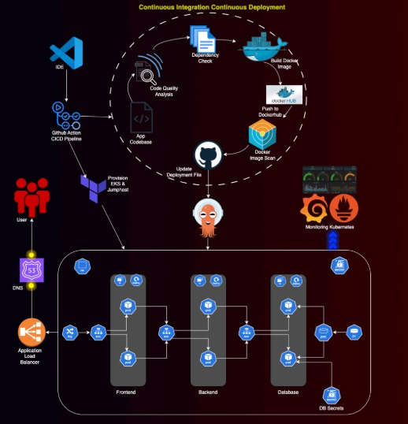
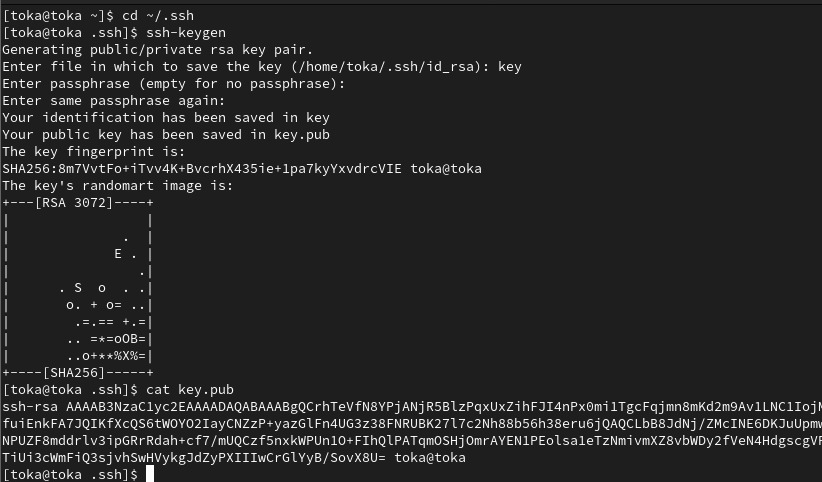
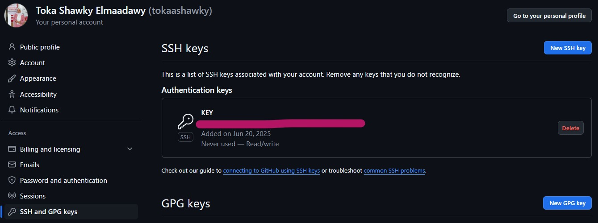
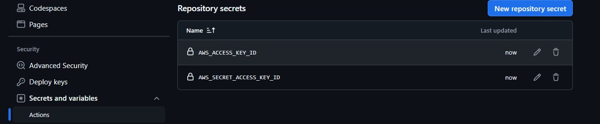

# Kubernetes CICD Project Using Github Actions and ArgoCD

### Project Introduction:
Welcome to the End-to-End Kubernetes Project guide! In this comprehensive project, we will walk through the process of setting up a robust Three-Tier architecture on AWS using Kubernetes, DevOps best practices, and security measures. This project aims to provide hands-on experience in deploying, securing, and monitoring a scalable application environment.

### Prerequisites:
Before starting this project, ensure you have the following prerequisites:

- An AWS account with the necessary permissions to create resources.
- Terraform and AWS CLI installed on your local computer.
- Basic familiarity with Kubernetes, Docker, CICD pipelines, Github Actions, Terraform, and DevOps principles.

### Step 1: SSH Exchange between local computer and Github account
**cd** to home dir and create **.ssh** folder if it doesn't exist 
```bash
cd ~/.ssh
ssh-keygen
```
Give the key a name **key**. Then list **ls** the content of .ssh/ folder.

Copy the content of the public key
```
cat key.pub
```


Go to the Settings of your Github account from profile section.\
Go to Access Section on the left **SSH and GPG Keys** and **New SSH key**.\
Give a title and paste the content of key.pub



Back to the computer terminal and run the command
```bash 
export GIT_SSH_COMMAND="ssh -i ~/.ssh/key"
mkdir ~/Desktop/project && cd ~/Desktop/project
git clone https://github.com/tokaashawky/End-to-End-DevOps-CI-CD-Project.git
git clone https://github.com/tokaashawky/infra_IaC_Code.git
cd infra_IaC_Code
git config core.sshCommand "ssh -i ~/.ssh/key -F /dev/null"
cd ..
cd End-to-End-DevOps-CI-CD-Project
git config core.sshCommand "ssh -i ~/.ssh/key -F /dev/null"
```

#### Connect the repository to your Github

1. **Create a New Repository on GitHub:**

2. **Change the Remote URL of Your Local Repository:**
```bash 
cd iac_code
git remote -v
git remote set-url origin <YOUR_NEW_REPOSITORY_URL>
```

3. **Push Your Code to the New Repository:**
```bash
    git add .
    git commit -m "Initial commit"
    git push -u origin master
```
If your main branch is named differently (e.g., **main**), replace **master** with the correct branch name.

Repeat for the second repo, When done, run the following command in your terminal
```bash
git config --global user.name <your github user name>
git config --global user.email <your github email>
```

### Step 2: CREATE AWS Resources
#### Create an IAM user with AdministratorAccess for testing purposes and generate the AWS Access key
#### Create Github Repo Secret for iac
1. **Navigate to Your GitHub iac Repository**
2. **Access the Repository Settings**
3. **Open the Secrets Section:Actions**
4. **Add a New Secret:**
   - Use **AWS_ACCESS_KEY_ID**.
5. **Save the Secret:**
   Actions workflows using the **${{ secrets.AWS_ACCESS_KEY_ID }}** syntax,\
   where **AWS_ACCESS_KEY_ID** is the name you gave your secret.\
   Do same for the **AWS_SECRET_ACCESS_KEY**, add the Secret and save
   
6. **Repeat 1-5 for app code repository**

#### Create S3 Bucket for Terraform State files 
#### Create key pair: Create key pair for SSHing into the jumphost in .pem format and download it in your local machine
